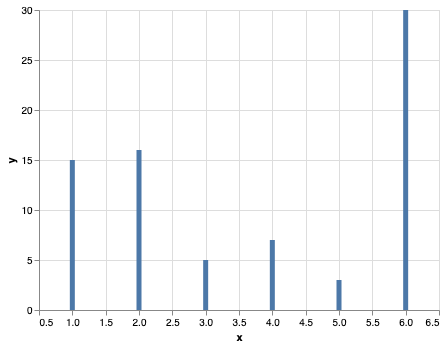

 

## But, tell me what is Altair? 🤔

[Altair](https://altair-viz.github.io/) is a python library for data viz, built upon [Vega](https://vega.github.io/) and [Vega-lite](https://vega.github.io/vega-lite/)

<--->


<--->





## Why should you care

- You need to create good looking or complex charts without too much boilerplate
- You don’t need to draw graphs
- You want easy to setup and advanced interaction
- Great integration in streamlit and jupyter
  

## I have seaborn, why should I choose Altair?

- Altair is slightly more beautiful for the same amount of code (IMHO)
- Layout management is easier in Altair
- You need to transform or filter data for the chart
- You want conditional rendering (color extreme values, etc)


## I am not convinced, show me what you got
OK fine, I know that you are a busy person so if I do not show you some beautiful stuff right now, you might leave before the end of the article.

Here we are:




## Base charts


### Preliminaries

Start by importing **pandas** and **altair**, build a dummy dataframe and 
instantiate a `Chart` object.

```python
import pandas as pd
import altair as alt

df = pd.DataFrame({
    "x": [1, 2, 3, 4, 5, 6], 
    "y": [15, 16, 5, 7, 3, 30],
    "z": [0.1, 0.4, 0.6, 0.2, 0.15, 0.8], 
    "names": ["Pierre", "Paul", "Jacques", "Pierre", "Paul", "Jacques"]
})

chart = alt.Chart(df).encode(
    x="x:Q", 
    y="y:Q"
)
```
`alt.Chart(data)` creates a `Chart` instance, which will use <u>columns</u> from `df` as core data.
By assigning *encodings* to the chart, one decides **how** data is displayed: which goes on the X axis, which goes on Y. There is several more encodings: color, theta, tooltip, etc. Moreover, what is the weird letter `Q` at the end of `x:Q` and `y:Q`? We'll cover that later.


Now, you should be willing to *display* something: dots, bars, area, grid?

For that, once you defined proper encodings, you can tell altair *what* to draw:



#### Scatter chart

```python
chart.mark_point()
```


<--->
#### Bar chart

```python
chart.mark_bar()
```



<--->
#### Line chart

```python
chart.mark_line()
```





## Recap

- Altair is a framework of data visualization in python. 
- It uses pandas DataFrame as data sources, and displaying charts are done in a triple step fashion:
  - Create the chart object `chart = alt.Chart(df)`
  - Tell altair what columns should be used, and how by specifying encodings: `chart_encoded = chart.encode(x=<column A>, y=<column B>)`
  - Tell altair what to draw by specifying a **mark**: `chart_encoded.mark_*()`


