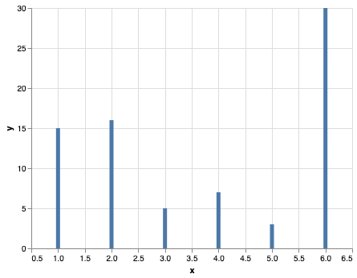
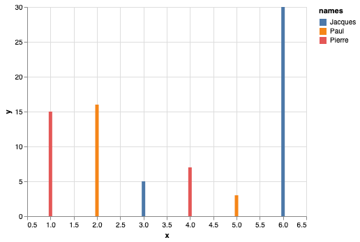
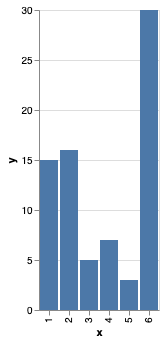
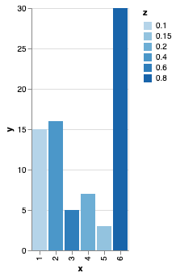
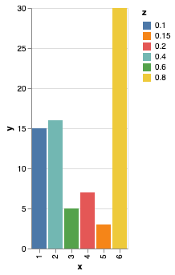
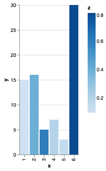
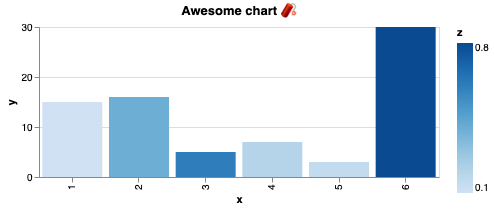
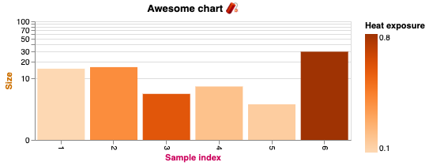

# You told me that my chart would look good but it's still ugly 🤡

Yes, I know what you're thinking. You created a chart using your dataframe, 
you defined proper encodings x and y for your chart, but you want more.

You want color, you want titles, you want textual information and so on. 
How to do it?

Let's take one problem at the time and discover a couple of concepts by the way.

First, let's assume you have the following script:

```python
import pandas as pd
import altair as alt

df = pd.DataFrame({
    "x": [1, 2, 3, 4, 5, 6], 
    "y": [15, 16, 5, 7, 3, 30],
    "z": [0.1, 0.4, 0.6, 0.2, 0.15, 0.8], 
    "names": ["Pierre", "Paul", "Jacques", "Pierre", "Paul", "Jacques"]
})

chart = alt.Chart(df).encode(
    x="x:Q", 
    y="y:Q"
).mark_bar()
```



# Adding color

There exist an encoding for specifying color. It is... `color`. 
For example, if we want the color to be set in function of the column _names_, 
the chart can be subsequently altered:

```python
chart.encode(color="names:N")
```

What it does is that the existing Chart object gets copied with the existing 
configuration (with mark and encodings) and we only encode a new channel, `color`.

For each row of the dataframe, we will have a bar of x and y coordinates with the color given by column _names_.
By default, defining a color adds a _legend_ to the chart



**Remark:** 
- When creating a pie chart using `mark_arc()`, color is not a required channel. 
However, you will not see the difference between portions of the graph, as the color is the same everywhere.

# Data types for rendering optimization
- If you looked carefully, you must have seen that when encoding color, we used `names:N` instead of `Q` as it was for
`x:Q` and `y:Q`. 
- These letters are data types, that Altair uses to optimize the rendering of each figure. 
- The available encodings are:
  - `Q` (quantitative)
  - `N` (nominal)
  - `O` (ordinal)
  - `T` (temporal)
  - `G` (geojson)

Let's try a couple of 
configurations for color, but first let's change the type of the x axis from quantitative to ordinal:

```python
chart = alt.Chart(df).encode(
    x="x:O", 
    y="y:Q"
).mark_bar()
```





<--->

You can see that there is no more ticks between each value on the x axis, as we declared the values being ordinal *(i.e. part of an ordered set of discontinuous values)*

<--->
<--->





## Ordinal color

```python
chart = alt.Chart(df).encode(
    x="x:O", 
    y="y:Q", 
    color="z:O"
).mark_bar()
```



<--->

## Nominal color

```python
chart = alt.Chart(df).encode(
    x="x:O", 
    y="y:Q", 
    color="z:N"
).mark_bar()
```



<--->

## Quantitative color

```python
chart = alt.Chart(df).encode(
    x="x:O", 
    y="y:Q", 
    color="z:Q"
).mark_bar()
```




Beautiful isn't it? Now you'll be able to do it as well!

# Dimensions, titles, and overall customization

Adding a chart title and specifying dimensions is pretty straightforward:
````python
chart = alt.Chart(
  df, 
  title="Awesome chart 🧨", 
  height=150, 
  width=400
).encode(
    x="x:O", 
    y="y:Q", 
    color="z:Q"
).mark_bar()
````

That results in:



Tips: You can define chart properties _a posteriori_, i.e. as the chart is already instanciated. You can do it this way:
`````python
chart = alt.Chart().encode(<encodings>).mark_*(<whatever>)
# Add properties before display
chart = chart.properties(data=<a_new_dataframe>, width=<new_width>, height=<new_height>...)
`````

By now, you should be wondering "_Ok, I can create charts with color, but I still don't know how to customize things 
in depth_ 🙄". And that's why this part is about introducing you to something **GREAT** that Altair offers: _encoding 
objects_.

## Encoding objects 

Encoding objects allow encodings to be defined by class instances instead of raw strings, enabling the 
full customization of graph.

For instance, imagine that we want to give a different title to the x and y axes and to the legend, 
that we want a logarithmic scale and that the color scheme does not correspond to what we like (as we saw a beautiful 
one described in the [vega documentation](https://vega.github.io/vega/docs/schemes/)):

````python
chart = alt.Chart(
  df, 
  title="Awesome chart 🧨", 
  height=150, 
  width=400
).encode(
    x=alt.X("x:O", title="Sample index", axis=alt.Axis(labelAngle=90)), 
    y=alt.Y("y:Q", title="Size", scale=alt.Scale(type="log", domainMax=100)), 
    color=alt.Color("z:Q", title="Heat exposure", scale=alt.Scale(scheme="oranges"))
).mark_bar()
````

That results in:




You can see that using `alt.X` (or `alt.Y`), one can define:
- Title
- Axis information (labels, ticks) and styling (font, size, color, angle for the axis) (
see [here](https://vega.github.io/vega/docs/axes/) the documentation)
- Scale information (type, data domain, but also approximation & interpolation) (
see [here](https://vega.github.io/vega/docs/scales/) the documentation)
- Bins (not shown here)

  
For `alt.Color`, one can define as well:
- Title
- Available colors using the Scale object (either by defining a _scheme_, either by defining a _range_)
- Legend (not shown here)


_Tips: sometimes, Altair does not display well log scales even though the considered numbers are all positive 
(strictly speaking). To tackle the issue, you may use the `symlog` type instead of `log`. The other way around is to 
open the chart in the Vega Editor, the display will be correct._

And that's it for today!

# Recap
- By leveraging the type of encodings, one can customize the rendering of the chart
- There are 5 distinct encodings to remember, whose shorthand are _Q_, _N_, _O_, _T_ and _G_
- You can add a title and specify dimensions of a given chart when creating it: 
`alt.Chart(df, title=..., width=..., height=...)`
- You can  customize the Chart further by using encoding objects instead of raw strings. A couple of interesting ones 
are:
  - alt.X, alt.Y, alt.Color, alt.Scale, alt.Axis, alt.Bin (for binned axis), alt.Theta (for radial charts)