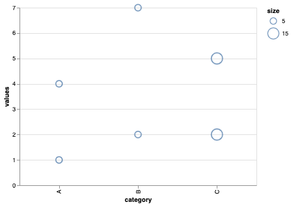

Since Altair is a framework of data-viz, talking about data transforms may seems odd. Especially if you are used to 
_pandas_, as you are probably saying to yourself "But why the heck should I care about 
data transformations, 🐼 is all about that! 🧐"

# Introduction


And yes, I agree. But before trying to change your mind about it, let's remember together why we need data 
transformations in our *life*:
- Filtering
- New features of any kind are required (whether they are simple type conversions or advanced transformations)
- Reshaping data (with aggregations eventually)
- Combining data

_Pandas_ is a powerful library due to its extensive API which permits basically everything. That capacity, however, 
comes at the cost of complexity. Not that it is hard to aggregate data nor to add a new column to a dataframe, but the 
readablity of pandas' code degrades over transformations, especially in _notebooks_: 
- DataFrames are regularly copied, variable names become longer and longer 
- Adding columns, filtering & grouping data becomes less and less clear even though transformations are kept simple


When performing data visualization, some of those transformations belong to only one chart. 

> Altair acknowledges the situation: some data transformations should only be bounded to a chart, and should be easy to 
> write and to understand. 

Altair transforms justify their existence by applying this philosophy.

In this article, we will cover most transforms associated to the four types described earlier, with code examples and 
visual results.

# Filtering

Associated transform:
- transform_filter
- transform_sample


Let's assume the following codebase:
```python
import altair as alt
import pandas as pd
import numpy as np

theta = np.linspace(-4*np.pi, 4 * np.pi, 100)
y = np.cos(theta) + np.random.randn(100) * 0.1

data = pd.DataFrame({
    "theta": theta, 
    "y": y
})

chart = alt.Chart(data).encode(
    x="theta:Q", 
    y="y:Q"
).mark_point()
```

That results in:


### transform_filter

Imagine that I want to restrict the study to the interval 0, pi.

One solution is to create a temporary dataframe (the 🐼 classic):
````python
data_filtered_on_theta = data[(data.theta <= np.pi) & (data.theta >= 0)]
````

It triggers me when I need to display a subset of a _pandas_ dataframe, as I am forced to copy and paste the name of the 
`ultra_long_processed_df_to_display`. 

The name of is usually so long, that it completely hides what is filtered. Moreover, you recreate a brand new dataframe 
in a dedicated cell of your jupyter notebook as it was useful for the remaining 90 cells, but nah you just want it for 
one chart.

It also s*cks because you spent more time thinking about how to name the newly filtered dataframe (like 
`ultra_long_processed_df_to_display_filtered`), and to be honest I feel that if you want to use any kind of filtering or 
transformation only for one chart, you should rather be able to do it in your chart specifications.

Otherwise, you just apply the method `transform_filter` on the chart, specifying how you want to filter data:
````python
chart = chart.transform_filter(
    (alt.datum.theta >= 0) &
    (alt.datum.theta <= np.pi)
)
````


By doing that, you realise that you do not need anymore to reference the name of the dataframe nor to create a new one, 
but instead you reference a `datum` object. What is it?

Well, according to the [documentation](https://vega.github.io/vega/docs/expressions/) of Vega, datum is:
> The current input data object, available within data transform and event handler expressions.

It also tells that:
> To lookup object properties, use normal JavaScript syntax: `datum.value` or `datum['My Value']`.
 

### transform_sample

I kinda dislike this transform because it only picks uniformly sampled subset of data of the desired size.
The only thing to remember is that 

````python
chart.transform_sample(100)
```` 

takes 100 rows in the dataset to display.

# Creating new features

## Adding columns
Associated transforms:
- transform_calculate
- transform_joinaggregate
- transform_window
- transform_stack
- transform_impute
- transform_regression
- transform_loess


### _transform_calculate_
If by any chance or whatsoever, you were about to add a new column with theta**2 + y + 1, in the ol' fashioned way you 
would do something like this:
````python
data_filtered_with_column = data_filtered.copy()
data_filtered_with_column["feature"] = data_filtered_with_column.apply(lambda r: r.theta**2 + r.y + 1, axis=1)
````

Then using altair's `transform_calculate` and [Vega Expressions](https://vega.github.io/vega/docs/expressions/) you can 
do it in a powerful one-liner:
````python
chart  = chart.transform_calculate(
    feature="pow(datum.theta, 2) + datum.y + 1"  # any name can be given to the feature
)
````
You'll be able to use the `feature` column in any of the encodings (`y` here).


I recently discovered that you can also use directly the datum object to add the column, in a more pythonic way. 
However, it does not work for all expressions (for example, conditional expressions are not supported) 

````python
chart  = chart.transform_calculate(feature=alt.datum.theta ** 2 + alt.datum.y + 1)
````

### transform_joinaggregate
Now, you can imagine that you need to compute an aggregate, and add it as a new column to your dataframe.
First, let's make up some categories A (theta < pi/2) and B (theta >= pi/2:

In this example, we assume that you want to compute a category-wise aggregate: the sum of _y_ values for each value of 
the column _category_. How do you do it in pandas?

Well, probably this way:
````python
# Create the column category
data_filtered_with_column_and_category = data_filtered_with_column.copy()
data_filtered_with_column_and_category["category"] = data_filtered_with_column_and_category.theta.apply(
    lambda value: 'A' if value > 0 else 'B'
)

# Create the aggregate
data_filtered_with_column_and_category["aggregate"] = data_filtered_with_column_and_category.groupby(
    "category"
).y.transform(sum)
````

Tedious, isn't it? 
If you desire to do it with altair, here is how you could do:

```python
chart.transform_calculate(
    category="datum.theta < PI/2 ? 'A' : 'B'"
).transform_joinaggregate(
    groupby=["category"],
    aggregate="sum(y)" 
)
```

By setting the `size` encoding using the newly created `aggregate` column, one can obtain the following graph:


The fact that you can **chain transforms** make this mechanism really powerful. In a single one of code you can declare in 
a very clear way what columns you want to add. 

The other awesome thing is that you can create multiple columns at once in each transform:
````python
chart.transform_calculate(
    category="datum.theta < PI/2 ? 'A' : 'B'", 
    feature="pow(datum.theta, 2) + datum.y + 1", 
    # ...
).transform_joinaggregate(
    groupby=["category"],
    aggregate="sum(y)",
    aggregate_z="stdev(z)",
    aggregate_feature = "sum(feature)"
    # ...
)
````

I'm sure you like it, your eyes don't lie 👀

**⚠️ Remark**: columns are created in the order of the transforms. You can therefore reference a column in a transform 
if it was created in a previous transform


### transform_window

Let's go quick on this one and the remaining transform, we already discussed a lot about the philosophy of pandas vs 
altair data transforms.

Let's assume that you want to compute a cumulated sum of _y_ values for each _category_, along the _theta_ axis:

````python
chart.transform_window(
    window_feature="sum(y)",  # Aggregate to compute
    groupby=["category"],  # Equivalent of PARTITION BY clause
    sort=[{"field": "theta"}],  # Equivalent of ORDER BY clause
    frame=[None, 0],  # Equivalent of UNBOUNDED PRECEDING until CURRENT ROW
)
````

Whoo! It looks like SQL, which is really convenient for creating windowed columns. If you need to have, let's say the 5 
last elements before the last element of the window, you just need to play with the _frame_ argument: `frame=[-5, -1]` 

### transform_stack


Stacking is used primarly for bar charts, pies and area plots. Instead of superposing graph objects (bars) such that 
they overlap, each graph object has an offset such that the displayed quantity is enterly visible.

Assume having data like this:

````python
import pandas as pd

data = pd.DataFrame({
    "category": ["M", "F", "M", "F", "M", "F"], 
    "day": ["Monday", "Monday", "Tuesday", "Tuesday", "Wednesday", "Wednesday"], 
    "amount": [10, 12, 4, 10, 8, 9]
})
````

By default, bars (and pies) are stacked. But not if we specify `stack=False` on the axis where _values_ are projected:



````python
alt.Chart(data).mark_bar().encode(
    x="day:N",
    y="amount:Q",
    color="category:N"
)
````


<--->

````python
alt.Chart(data).mark_bar().encode(
    x="day:N",
    y=alt.Y("amount:Q", stack=False),
    color="category:N"
)
````




This is generally enough to decide if you want to stack on the Y axis or not.
But if you need to use the edge values of each bar, transform_stack is your friend;
to reproduce the same as above:

````python
alt.Chart(data).mark_bar().encode(
    x="day:N",
    y="amount_low:Q",
    y2="amount_high:Q",
    color="category:N"
).transform_stack(
    stack="amount", 
    groupby=["day"],
    as_=["amount_low", "amount_high"]
)
````

### transform_impute

Very quick here. it's Altair's _fillna_.

I never used it, but the cool thing is that you can fill values using moving averages:

````python
chart.transform_impute(
    impute="amount",  # Change null values of "amount"
    method="mean", # By computing the mean of its non-null values
    key="day", # Over the "day" axis
    frame=[None, 0], # By taking rows since the beginning until the current row
    groupby=["category"], # Rows should have the same "category" of the current row
)
````


For simple use cases, I would definityly go for pandas' _fillna_ but for advanced case I would hesitate.
Nonetheless, if I need new features that I want to visualize quickly, I'll give a shot for _transform_impute_!

I advise you to check the documentation if you want to know more about it:
- [Altair doc](https://altair-viz.github.io/user_guide/transform/impute.html)
- [Vega doc](https://vega.github.io/vega-lite/docs/impute.html)


### transform_regression, transform_loess

Both of these techniques compute the regression of a given variable in function of another.

The former has 6 methods, `linear`, `log`, `exp`, `pow`, `quad`, `poly` and seem to permit regression on a **per-group** 
basis.

The latter is a _Locally Estimated Scatterplot Smoothing_ technique; which is basically a regression technique that 
involves multiple regression models, each being trained on segments of nearby data points instead of using the whole 
dataset. 

In the context of data visualization, it seems that this technique could be used when you have a lot of data points 
that you need to summarize without spending time on finding the right regression method, or that computing the average 
of the data points (y) for each value of the explicative variable (x) is not sufficient for representing well your 
dataset.

## Aggregated features
- transform_density
- transform_bin
- transform_timeunit
- transform_aggregate
- transform_quantile


### transform_density {#-transform_density}

In _seaborn_, you have the function _kdeplot_ that displays the density curve of a given variable, by performing a 
_Kernel Density Estimation_ (KDE). It is easy to setup: 

```python
kdeplot(data, x=<x_column>)
```

Using altair, here is how we do:

````python
import pandas as pd
import altair as alt
import numpy as np


data = pd.DataFrame({"y": np.random.randn(300)})

alt.Chart(data).transform_density(
    "y", 
    as_=["values_of_y", "density"]
).mark_area(color="lightblue").encode(
    x="values_of_y:Q", 
    y="density:Q"
)
````


You should remember that the mind of altair, a distribution plot is just a plot like all others, but with KDE features 
computed using _transform_density_. Therefore, one can display the results with an area using `mark_area` (as shown 
here), but also using only lines (`mark_line`) or whatever mark you want.

### transform_bin

This transformation is similar to transform_stack. It bins a column following a certain specification, resulting in two 
columns corresponding to the bin start and stop.

You usually don't need it, unless you want to make it clear that you are using a binned column within all your chart.

Binning forces you to use aggregations, as each bin of a given column corresponds to a bucket of values.

You can compute the histogram of `y` this way (following data defined in [transform_density](#-transform_density): 


````python
alt.Chart(data).transform_bin(
    as_="bin",
    bin=True,  # bin parameters, or True
    field="y"
).encode(
    # Ordinal type is better when using only one bin column
    x="bin:O",   
    y="count(bin):Q"
).mark_bar()
````


<--->

````python
alt.Chart(data).transform_bin(
    as_=["bin_start", "bin_end"],
    bin=True,  # bin parameters, or True
    field="y"
).encode(
    x="bin_start:Q",
    x2="bin_end:Q",
    y="count(bin):Q"
).mark_bar()
````




### transform_timeunit

I'm gonna be honest with you folks, I never used this transform.

But it looks like it's the same thing as transform_bin, except that it's dedicated to time data.
The difference is how you control bin sizes, as it powers the discretization of data into _known_ time units, from 
milliseconds to years.

Similarly to transform_bin, you can obtain the start and end columns of each time interval.

More info can be found [here](https://altair-viz.github.io/user_guide/transform/timeunit.html) or 
[there](https://vega.github.io/vega/docs/transforms/timeunit/)

### transform_aggregate

The _groupby_ of Altair is _transform_aggregate_. I find it very readable, and can do the basic stuff that you need most 
of the time.

By computing the mean, the sum and the standard deviation of a column of data grouped by another, one would do it as:
````python
alt.Chart(
    <data>
).transform_aggregate(
    groupby=[<column_groupby>], 
    mean_col="mean(<column>)",
    sum_col="sum(<column>)", 
    stdev_col="stdev(<column>)"
)
````

Like in transform_calculate, you can compute several aggregates within one transform_aggregate call.
It's crystal clear and quick to setup.

### transform_quantile

I never used this transform as well, but it basically compute two columns corresponding to quantile (as a probability), 
value pairs.

transform_quantile therefore compute a normalized cumulated histogram.

In other words, the first column corresponds to the cumulated count of values of a given field (relatively to the total 
count) while the second column corresponds to binned values of the same field.

Let's check the difference with:




#### transform_quantile

````python
import pandas as pd
import altair as alt
import numpy as np


df = pd.DataFrame({'x': np.random.randn(200)})


alt.Chart(df).transform_quantile(
    'x', 
    step=0.01
).mark_point().encode(
    x='prob:Q',
    y='value:Q'
)


````


<--->

#### composition of transforms
````python
alt.Chart(df).transform_bin(
    "value", "x", bin=alt.BinParams(step=0.01)
).transform_aggregate(
    groupby=["value"], count_x="count(x)"
).transform_joinaggregate(
    count_x_total="sum(count_x)"
).transform_window(
    cumsum_x="sum(count_x)", 
    frame=[None, 0], 
    sort=[{"field": "value"}]
).transform_calculate(
    prob="datum.cumsum_x / datum.count_x_total"
).mark_point(color="orange").encode(
    y="value:Q",x="prob:Q"
)
````




You can see that the two curves are almost the same (at the exception of the edge points), but nonetheless one of the 
curves is far easier to build 😉

# Reshaping data
Associated transforms:
- transform_flatten
- transform_fold
- transform_pivot

### transform_flatten

If any of your columns has an array-like object type, you may want to create one row per value in the array:

````python
import pandas as pd

pd.DataFrame({
    "category": ['A', 'B', 'C'], 
    "nested_values": [[1, 2, 3], [4, 5, 6], [7, 8, 9]]
})
````

With a transform_flatten, your dataframe will be like:

````python
pd.DataFrame({
    "category": ['A', 'B', 'C', 'A', 'B', 'C', 'A', 'B', 'C'], 
    "unnested_values": [1, 2, 3, 4, 5, 6, 7, 8, 9]
})
````
> The use case where this is appropriate is when loading JSON data. 
> [documentation](https://altair-viz.github.io/user_guide/transform/flatten.html)

### transform_fold

You got too many columns? You want more rows? Then transform_fold is for you.
What it does is converting _wide-form data to long-form_, meaning:
You have N columns that represent a similar thing, a metric for example:

````python
data = pd.DataFrame({"Count": [19], "Sum": [10], "Stdev": [5], "Mean": [1.5]})
````

Now, if I fold those columns:

````python
alt.Chart(data).transform_fold(
    fold=["Count", "Sum", "Stdev", "Mean"], 
    as_=["Aggregate", "Value"]
)
````

I will have the following table:

````python
data = pd.DataFrame({
    "Aggregate": ["Count", "Sum", "Stdev", "Mean"], 
    "Value": [19, 10, 5, 1.5]
})
````

It is useful to display several different metrics on the same chart: you start by folding the metric columns, then you 
encode the "Aggregate" field as mark color such that multiple curves of the "Value" are displayed. 


### transform_pivot

transform_pivot is to transform_fold what Yin is to Yang ☯

Need more explanations?

If you start with this data:

````python
data = pd.DataFrame({
    "Aggregate": ["Count", "Sum", "Stdev", "Mean"], 
    "Value": [19, 10, 5, 1.5]
})
````

Then by applying transform_pivot on the "Aggregate" column:

````python
alt.Chart(data).transform_pivot(
    pivot="Aggregate", 
    value="Value"
)
````

You will obtain:

````python
data = pd.DataFrame({"Count": [19], "Sum": [10], "Stdev": [5], "Mean": [1.5]})
````

There seems to be a little more cool stuff as you can compute grouping and aggregations during de pivot transform, but 
in this scenario it is not relevant.

# Combining data
- transform_lookup

### transform_lookup

transform_lookup is your friend if you need to join dataframes together in the scope of a given chart.
Again, if you need to use the merged dataframe later in your notebook, you should prioritize pandas' API over Altair 
transforms.

Basically, here is an example of how you use it. Given the following data:

````python
import pandas as pd
import altair as alt

main_data = pd.DataFrame({
    "category": ["A", "B", "C", "A", "B", "C"], 
    "values": [1, 2, 5, 4, 7, 2]
})

auxiliary_data = pd.DataFrame({
    "category": ["A", "B", "C"], 
    "size": [10, 10, 15]
})
````

You can then use the transform that way:

```python
chart = alt.Chart(main_data).transform_lookup(
    from_=alt.LookupData(  # Join main_data with
        data=auxiliary_data,  # auxiliary_data
        fields=["size"],  # By selecting "size" from the lookup data
        key="category"  # Using "category" as right key
    ),
    lookup="category"  # And "category" as left key
).encode(
    x="category:N",
    y="values:Q",
    size=alt.Size("size:Q",
                  # Unnecessary legend customization
                  legend=alt.Legend(values=auxiliary_data["size"].drop_duplicates().tolist()))
).mark_point()
````

That would result in:



I'm not sure whether I would prefer this method over `DataFrame.merge`, but for the sake of consistency I would give a 
try to this Altair's transform. 

# Conclusion


