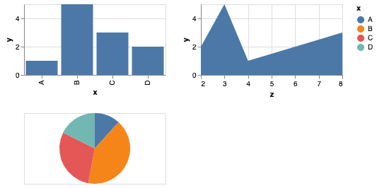

If -as me- you started data visualization using [matplotlib](https://matplotlib.org/), you must already know how painful it is to create 
charts having a complex layout. 

From adding textual information to creating a subplots effectively, we'll see how _Altair_ deals with advanced 
charts with ease. 

We'll cover a couple of topics in this article, which are: horizontal and vertical layout, grid 
subplots, and layering.


# Horizontal, vertical and facet (grid) layouts

## Summary
- Horizontal concatenation
  - Use case: put next to each other charts that do not share the same data, or whose visualizations are not of the same
kind
```python
chart = chart1 | chart2
````

- Vertical concatenation
  - Use case: idem above 
```python
chart = chart1 & chart2
````

- Repeated charts
  - Use case: For a same dataset, cross-compare columns pairs by creating a grid of charts
  - Tips: prefer _repeated_ over _facet_ charts for wide-format data
````python
chart.encode(
    x=alt.repeat("row"), 
    y=alt.repeat("column")
).repeat(
    row=[<col1>, <col2>], 
    column=[<col3>, <col4>]
)
````
  
- Facet layout
  - Use case: you used all available encodings (axes, color, size...) and you still need one dimension to represent your 
data. One chart is created per value of a given column - perferably of ordinal or nominal type. 
  - Tips: prefer _facet_ over _repeat_ for long-format data
````python
chart.facet(<column_on_which_to_create_a_grid>)
````

## In practice


### Mixing concatenations in both direction

It is totally possible to mix vertical and horizontal concatenation. As an example:

```python
import pandas as pd
import altair as alt

data = pd.DataFrame({
  "x": ["A", "B", "C", "D"],
  "y": [1, 5, 3, 2],
  "z": [4, 3, 8, 2],
  "t": [2, 7, 5, 3]
})


base = alt.Chart(data, width=200, height=100)
top_left = base.mark_bar().encode(x="x:N", y="y:Q")
top_right = base.mark_area().encode(x="z:Q", y="y:Q")
bottom_left = base.mark_arc().encode(theta="t:Q", color="x:N")

chart = (top_left | top_right) & bottom_left
```

The resulting chart is:




_Tips_: The size that is set in alt.Chart(width=..., height=...) applies to each Chart instance

### Grid layout

Let's assume that we have the following data:

````python
import altair as alt
import pandas as pd
import numpy as np

# Build an array of 3 times 50 points from 0 to 2*Pi, put along each other
x = np.tile(
    np.linspace(0, 2 * np.pi, 50), 
    3
)
# Build cosine, sine and hyperbolic cosine curves
y = np.concatenate([
    np.cos(x[:50]),
    np.sin(x[50:100]),
    np.cosh(x[100:])
])
category = ["Cosine"] * 50 + ["Sine"] * 50 + ["Hyperbolic Cosine"] * 50

data = pd.DataFrame({
    "x": x,
    "y": y,
    "category": category
})
````

Then, imagine that we want to display points of (X, Y) coordinates such that:
- We need to have one chart per category
- We need to color in green when the Y value is positive, and red elsewhere

Then, what we could do is:

````python
chart = alt.Chart(data).mark_point().encode(
    x="x:Q",
    y="y:Q",
    color=alt.condition(alt.datum.y >= 0, alt.value("green"), alt.value("red"))
).facet(
  "category:N"
).resolve_scale(y="independent")
````
You should obtain the following chart:


To customize how you want to render the grid, you can play with the arguments of `Chart.facet` which permit to set the 
number of columns you want to display.

You should also notice 3 new concepts here:
- **alt.condition**

that permits developers to set their own criterion to display data. The first argument is the _predicate_, and the two 
next is there to say "take the value of this if true, else take this value".

Note that you can either set those values as _columns_ of the dataframe, or static values.


- **alt.value**

alt.value enforce Altair to use a value as an encoding instead of a column name. If you don't use this wrapper around 
the value you need as unique color/x/y/whatever encoding, it is likely to fail. 

- **Chart.resolve_scale**

Notice that _cosh_ skyrockets above 250 of value on the y axis? By default, altair says "every chart of a given facet 
share the same axes". You need to set them independent in this case, otherwise the sine and cosine curves would be flat 
as _\<insert a bad joke here\>_.


# Layering

## Summary

- Layer two charts
  - Use case: adding textual information on an existing chart
````python
chart = chart1 + chart2
````
- Layer an arbitrary variable number of charts
````python
chart = alt.layer(chart1, chart2, chart3)
````
- Dual axis chart (double y axis): 
````python
chart = (chart1 + chart2).resolve_scale(y="independent")
````

## In practice 

### Adding text to a bar chart

In the dawn of times, it was difficult to draw text on charts. 
But with Altair - and possibly with other frameworks that I don't know -  came a new era where charts comprising textual 
annotations were not the exception, but the rule.

Indeed, let's consider the following data:

````python
import pandas as pd

data = pd.DataFrame({
  "x": [7, 9, 12, 10], 
  "y": ["A", "B", "C", "D"]
})
````

Then, to draw a chart with any mark, and text, one should just need to write:
````python
base = alt.Chart(data).encode(
  x="x:Q", 
  y="y:N"
)

chart = base.mark_bar()

text = base.mark_text(dx=10).encode(
  text="x:Q"
)

final_chart = chart + text
````

That results in:


### Double axis chart

If you need a double axis chart using altair, nothing easier.
Given the following data:
````python
import pandas as pd

data = pd.DataFrame({
  "x": ["A", "B", "C", "D"], 
  "y": [10, 40, 30, 20], 
  "z": [400, 200, 300, 100]
})
````

Let's try to draw bars for the _y_ column, and lines for the _z_ field:

````python
# You create the base chart, which shares common properties between bars and lines
base = alt.Chart(data, width=400).encode(
    x="x:N"
)

# Encode just what you need to create the bars
bars = base.mark_bar().encode(
    y="y:Q"
)

# Idem for lines
lines = base.mark_line(color="orange").encode(
    y="z:Q"
)

# Layer the two resulting charts, and set y as an independent axis
chart = (bars + lines).resolve_scale(y="independent")
````

You should obtain the following result:


## Limits: grid of dual axis charts 

Altair does not permit _faceted_ nor _repeated_ layered charts with **independent axes**, although you can facet layered 
charts in general.

However, it is still possible to create grid layouts, by iteratively building the final chart.

Let's take the following data:

````python
import pandas as pd


data = pd.DataFrame({
    "A": [1, 4, 6, 3, 6],
    "B": [6, 3, 6, 2, 5],
    "x": [1, 2, 3, 4, 5],
    "t": [2022, 2022, 2022, 2023, 2023]
})
````

And assume that
- We want to display columns "A" and "B" on a separate y axis, bars for "A" and line for "B"
- Using "x" as X axis
- Such that we have one graph per year (column "t")

We can check the two first objectives with the following code:

````python
base = alt.Chart(data).encode(x="x:O")
chart_left = base.encode(y="A:Q").mark_bar()
chart_right = base.encode(y="B:Q").mark_line(color="orange")
chart = (chart_left + chart_right).resolve_scale(y="independent")
````


But that won't produce one chart per year (cf figure above). To do that, we'd like to write:
````python
chart = chart.facet("t:O")
````

Unfortunately, that won't work because you are trying to facet a layered chart. 

To tackle the issue, you could iterate over the 
unique values of the column "t" to create one chart per value of "t", and apply the _reduce_ function from the 
_functools_ package to build the horizontal layout:

````python
from functools import reduce

charts = []
for value in data.t.unique():
    charts.append(chart.transform_filter(alt.datum.t == value))

final_chart = reduce(lambda c1, c2: c1 | c2, charts)
````

or, in a more _Altair_ way:
````python
final_chart = alt.concat(*[
  chart.transform_filter(alt.datum.t == value) 
  for value in data.t.unique()])
````


Not so hard, right? Things get more complex though, when you need to have N rows and M columns. Nonetheless, the logic 
remains the same as you would build a list of lists of charts, that you would reduce _twice_ to build a _grid_.


# Conclusion

In this article, you could see how to manage layout effectively by using concatenation and layering, and how to apply 
conditional fields or static values.

We could see the limits of the _facet_ operation, and how to overcome it.