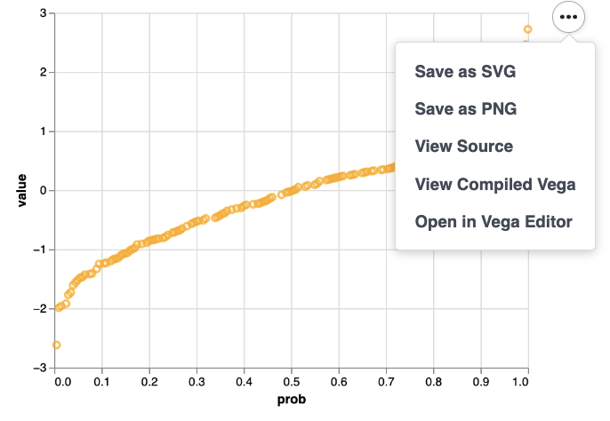

This article is mostly addressed to developers that need to embed interactive charts within web apps, and who are 
willing to find the extent of the interactions you can have with Altair charts. 

Let's check it out!


# Adding interaction

## Summary

- Zoom and pan 🔍
````python
chart = chart.interactive()
````
- Color a subset of data 🎨

````python
selection = alt.selection_multi(
  fields=["column_A", "column_B"]  # You can select multiple elements for each column in fields
)  
chart = chart.encode(
    color=alt.condition(  # Within the selection, elements colored in green. Elsewhere, in red
      selection, 
      alt.value("green"), 
      alt.value("red")
    )  
).add_selection(selection)
````

- Filter a subset of data (2 charts) 🔽

````python
selection = alt.selection_multi(encodings=["x"])  # You can select multiple elements on the x axis
main_chart = chart.add_selection(selection)  # Chart on which you want to filter elements
filtered_chart = chart.transform_filter(selection)  # Chart on which you want to see only filtered elements
final_chart = main_chart & filtered_chart  # Vertical concatenation
````

- Filter a subset of data (chart & input driven element) 🔽

````python
binding = alt.binding_select(
  options=["A", "B", "C"],  # Selection is done by chosing one amongst 3 values: "A", "B" or "C" (✅ categorical data)
  name="Letter"  # Displayed name near the control
)
selection = alt.selection_single(encodings=["x"], bind=binding)  # You can select multiple elements on the x axis
chart = chart.transform_filter(selection).add_selection(selection)  # Chart on which you want to filter elements
````
 

## Explanations

Interactions in altair consist in allowing users to display subsets of data by interacting with the chart:
- Either you want to zoom and pan (you display a subset of data when you zoom-in or pan out of axis bounds)
- Or you need to draw only a subset of data that you want to pick dynamically
- Or you need to draw a subset of data with a peculiar style that you would choose dynamically

Interaction is made in 2 or 3 steps:
1. _**HOW**_: decide how to pick a subset of data
  - If click and drag is enough, nothing to do here
  - If custom events (such as _mouseover_ or anything registered in vega [event streams](https://vega.github.io/vega/docs/event-streams/)) 
are desired, you can instantiate a string named _binding_ with the name of the event (or 'scale' if you need only zoom & pan)
  - If an interaction through buttons is needed, you can instantiate a binding with `binding=alt.binding_*`
    - Available bindings are radio buttons, checkboxes, range (slider), and select (drop-down list)

````python
binding = "mouseover"  # When you hover on a data element, that selects the data
binding = altair.binding_radio(
    options=["a", "b"] # 'a' and 'b' can either be column names, or values to select or discard
)
````
2. _**WHAT**_: Declare what subset of data you want to pick, using _alt.selection_ and the previously configured _binding_

````python
selection = altair.selection_single(
  encodings=["x"],  # The selection of a single element on the X axis should be applied 
  bind=binding  # Using the binding defined earlier (optional)
)


selection = altair.selection_single(
    encodings=["x"], 
    bind="legend",  # Will set an interactive (clickable) legend 
    on="mouseover"  # Interactivity is also triggered when hovering data points
)
````

3. _**WHERE**_: Declare on which chart the interaction should apply, using `chart.add_selection`
````python
chart = chart.add_selection(selection)
````

And finally, depending of the use case you do other stuff:
- Filtering data:
````python
chart = chart.transform_filter(selection)
````

- Adding conditional encodings:
````python
chart = chart.encode(x=alt.condition(selector, "x:Q", alt.value(0)))
````


## Use cases


### Select specific categories of data

> If you have a categorical column in your data, and you would like users to select one in several values, 
> here is how you could do: 

````python
import altair as alt
import pandas as pd

data = pd.DataFrame({
    "x": [1, 2, 3, 4, 5],
    "y": [6, 3, 6, 2, 5],
    "year": [2022, 2022, 2022, 2023, 2023]
})

binding = alt.binding_select(options=[2022, 2023], name="Year")
selection = alt.selection_single(bind=binding, fields=["year"])
chart = alt.Chart(
    data, width=400, height=200
).mark_bar().encode(
    x="x:O",
    y="y:Q",
    color="year:O"
).transform_filter(
    selection
).add_selection(
    selection
)
````

The resulting chart would look like this:



### Interactive legend

> When your goal is to distinguish groups of data points by choosing their categories in the legend

````python
data = pd.DataFrame({
    "x": [1, 2, 3, 4, 5],
    "y": [6, 3, 6, 2, 5],
    "year": [2022, 2022, 2022, 2023, 2023]
})


selection = alt.selection_single(fields=["year"], bind="legend", on="mouseover")
chart = alt.Chart(
    data, width=400, height=200
).mark_bar().encode(
    x="x:O",
    y="y:Q",
    color="year:O",
    opacity=alt.condition(
        selection, 
        alt.value(1.0), 
        alt.value(0.2)  # Selected data points have an opacity of 1.0, others of 0.2
    )  
).add_selection(
    selection
)
````

The result would be like:





# Embedding visualizations

## Using Streamlit

Nothing easier here, as you may not already know, but the base visualizations (line, bar and area charts) of 
[streamlit](https://streamlit.io/) use Altair. 

But if you need to display your customized chart, here is how you do:
```python
# Instantiate the Chart object
chart = alt.Chart(...)

# Display it 
st.altair_chart(chart)
```

## Using Javascript

In this very blog, you probably saw an altair chart in the first article.
You need a couple of things to make this work, according to [vega-embed](https://github.com/vega/vega-embed):
1. The right headers in your HTML (to add the _vega_ JS libraries)
````HTML
<!-- Vega, Vega-lite and Vega-embed -->
<script src="https://cdn.jsdelivr.net/npm/vega@5"></script>
<script src="https://cdn.jsdelivr.net/npm/vega-lite@5"></script>
<script src="https://cdn.jsdelivr.net/npm/vega-embed@6"></script>
````
2. A JSON specification of your chart (which can be extracted easily by hovering the mouse on the chart, and clicking on 
the "View Source" option)



<--->



<--->




3. Call the right JS functions to transform your JSON spec' into displayable stuff. Here's a snippet encapsulating 
appropriate functions calls:
````javascript
<script type="text/javascript">
    function display_altair_chart(spec_url, div_id) {
        // Render a JSON specification into a <div> identified by its ID
        vegaEmbed(`#${div_id}`, spec_url)
            .then(console.log)
            .catch(console.warn);
    };
</script>
````


## Using pyscript
No, don't. 👀


# Conclusion

In this article, you should have learned how to add interaction capabilities for your charts, and how to embed them in 
web apps.

I encourage you to check the examples provided by altair's [gallery](https://altair-viz.github.io/gallery/index.html#interactive-charts)
as they provide far more examples than what is shown here. Nonetheless, you should have enough here to fly with your own 
wings! 🦃


Another great tutorial about interactivity I would advise you to see is [this one](https://altair-viz.github.io/altair-tutorial/notebooks/06-Selections.html), 
as there are good examples of interval selection, or interactivity using multiple charts.
  

I believe that this article concludes the series on **Altair-viz**, if a comeback is needed it will certainly be 
oriented around use cases, and not around the theory.

**I hope you enjoyed!**


