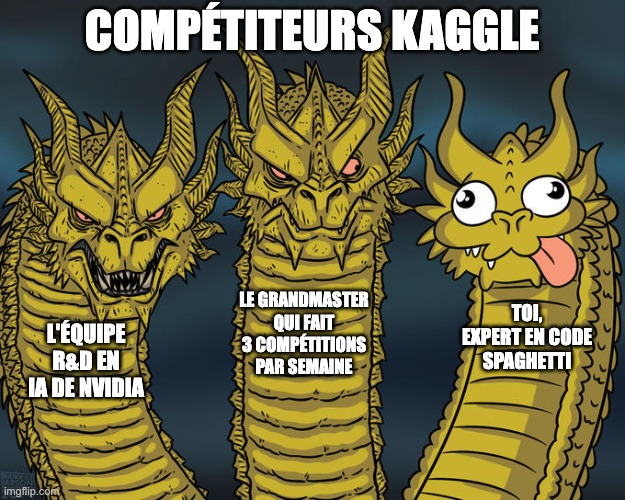
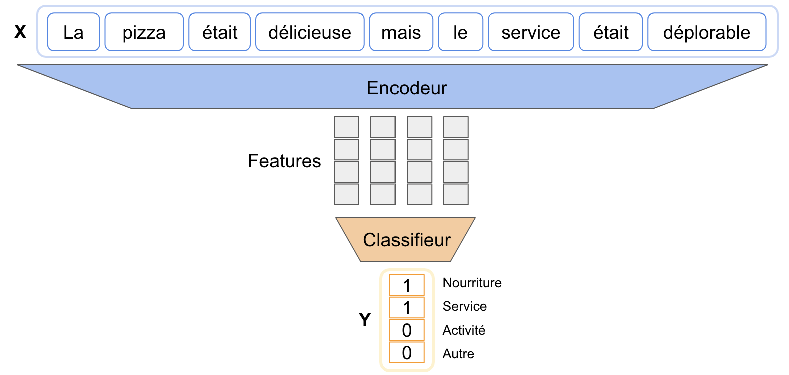
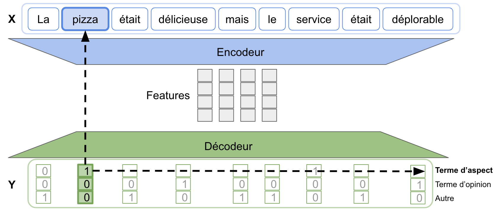
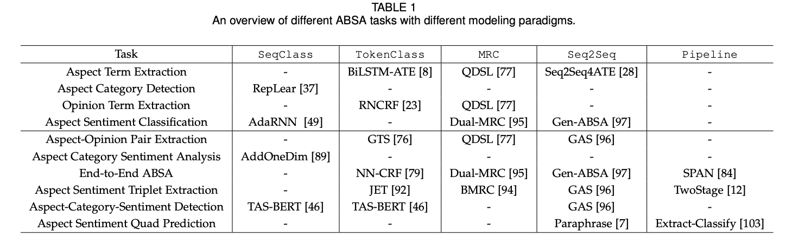

Dans cet article nous allons parler de modélisation, ou comment aborder un problème en analyse de sentiment basée sur 
l'aspect.

# Mise en situation
Lundi 27 février 2023, 10:05. 

Votre ami Eustache vient de vous parler d'une n-ième compétition Kaggle, dont le prix dépasse de très loin votre bonus 
annuel de trois malabars et 5 points d'inflation. 

Alors en plein travail -mais la fin justifiant les moyens-, vous laissez tout en plan pour vous connecter illico sur 
votre compte, pour voir de quoi il en ressort. 

La langue pendante après avoir observé de vos propres yeux la récompense affichée, vous commencez à lire le sujet afin 
de comprendre ce qui vous est demandé. Il est écrit des termes bizarres comme "topics", "sentiments", "opinion" et peu à 
peu, votre regard devient blême et votre teint se jaunit. Votre coeur devient lourd et c'est alors que vous vous écriez 
en plein open-space: 

_«Mais comment je résous ce problème moi?!»_

Pris de panique en remarquant les nuages sombres au dessus de la tête de votre manager, vous vous excusez d'un ton las 
puis vous vous remettez à penser. Par un éclair de génie (et parce que vous avez lu l'[article précédent](/posts/2023-s6) bien sûr), vous réalisez d'un coup qu'il s'agit d'une tâche d'analyse de 
sentiment basée sur l'aspect: vous devez prédire simultanément les topics avec leur polarité dans chaque texte de la 
base de donnée présentée.

Votre sang se glace alors davantage, puisque vous ne savez pas du tout comment vous y prendre. 




Heureusement pour vous, vous décidez d'aller voir sur [weekly-tech.io](https://weekly-tech.io) pour voir si un article 
peut répondre à votre seconde question: 

_"Sur quoi vais-je pouvoir faire fit predict?"_

Par chance, c'est ce dont on va parler aujourd'hui.

# Composantes d'architecture

Dans cet article, nous allons introduire trois composantes d'architecture:
- Encodeurs (noté parfois \\(Enc\\))
- Décodeurs (\\(Dec\\))
- Classifieurs (\\(CLS\\))

Ce sont des termes classiques en apprentissage automatique, mais on retrouve certaines particularités quant aux méthodes 
concernées en analyse de sentiment basée sur l'aspect. Regardons de plus près! 

## Encodeurs

L'encodeur se charge de convertir le texte donné en entrée d'un modèle prédictif, afin d'en retourner des descripteurs 
(ou features) qui **concentrent** des éléments de sens et de contexte de celui-ci.

Les encodeurs sont composés généralement de deux parties distinctes dans les problèmes de NLP:
1. Le prolongement lexical
2. L'extraction de features

Comme j'aime faire les choses dans le désordre, commençons par parler du second point.

### Extraction de feature

Manifestement, il y a une diversité dans les approches d'encodage en ABSA (Aspect Based Sentiment Analysis); on y retrouve: 
- Réseaux de neurones convolutifs 
- Réseaux de neurones récurrents
- Transformers et modèles de langages pré-entraînés (PLM) type BERT

Bien qu'il s'agisse là d'un méli-mélo de techniques qui semblent toutes se valoir, les études les plus récentes tendent 
à montrer que les approches à bases de _transformers_ (et entre autres, de PLM) sont les plus performantes.

### Prolongement lexical (word embeddings)

Les techniques d'extraction de features travaillent sur des vecteurs et des matrices, mais en analyse de sentiment la 
matière première est du texte brut.

Représenter ce texte sous forme vectorielle est donc un point clé dans l'extraction d'information qui vient par la 
suite. Une telle transformation s'appelle un **prolongement lexical**.

Quelques remarques sont bonnes à prendre:
- Les techniques les plus courantes sont appelées Word2Vec et GloVe (vous pourrez utiliser ces embeddings avec des libs 
python, par exemple [gensim](https://pypi.org/project/gensim/))
- Si vous voulez utiliser des réseaux convolutifs ou récurrents, vous _devrez_ calculer **manuellement** les embeddings
- En revanche, les approches basées sur les modèles de langage pré-entraînés viennent généralement accompagnées de leur 
propre technique de prolongement lexical.

## Classifieurs et Décodeurs

Les **classifiers** sont généralement une partie moins complexe de l'architecture d'un modèle. On y retrouve dans les 
grandes lignes des perceptrons multi-couches accompagnés d'une couche de de softmax ou de sigmoïde.
Eventuellement, on peut retrouver des CRF (conditional random fields, de la famille des modèles probabilistes)

Les **décodeurs** peuvent varier du très simple avec du perceptron multi-couches, au très compliqué avec des approches type 
LSTM ou transformers.

# Modélisation

L'étape de modélisation permet de définir l'allure des entrées-sorties d'un modèle prédictif.
Dans le cas de l'analyse de sentiment basée sur l'aspect, on peut dénombrer 4+1 paradigmes:
- _Sequence-level Classification (SeqClass)_
- _Token-level Classification (TokenClass)_
- _Machine Reading Comprehension (MRC)_
- _Sequence-to-Sequence (Seq2Seq)_

Ajouté à ces quatres familles de modélisation, on compte également un méta-paradigme: les méthodes dîtes 
_Pipeline_.

## Sequence-level Classification (SeqClass)

Les méthodes SeqClass ressemblent aux méthodes de classification usuelles en _terme de formulation_, à savoir que l'on a
pour chaque entrée, un nombre fixé de classes en sortie.

Cela permet par exemple de prédire pour chaque texte d'entrée les catégories d'aspect présentes.

En considérant un texte d'entrée \\(X\\), et on cherche à prédire un vecteur de taille M, _one-hot_ ou _multi-hot_ 
(rempli de 0 et de 1).

Ce paradigme de modélisation fait intervenir un encodeur (noté \\(Enc\\)) permettant d'extraire des descripteurs de la 
phrase, et un classifieur (noté \\(CLS\\)) exploitant ces derniers afin de prédire les classes désirées.

> Formulation: \\(Y = CLS(Enc(X))\\)





Sur la figure explicative ci-contre, on peut remarquer que le résultat d'un modèle SeqClass donne des informations de 
façon globale sur la phrase en entrée.

## Token-level Classification (TokenClass)

Le nom parle de lui-même, on effectue un lot de prédictions par token du texte donné au modèle.

La sortie a donc la même longueur que l'entrée, elle est une matrice \\((N, M)\\) où N est le nombre de tokens et M le 
nombre de classes à prédire.

A la différence du paradigme SeqClass, c'est un décodeur et non un classifieur qui succède à l'encodeur.

> Formulation: \\(Y = Dec(Enc(X))\\) avec \\(dim(Y) = dim(X)\\)





Cette modélisation est très puissante car elle dispose d'une fine granularité sur la prédiction, en qualifiant chaque 
token de la phrase en entrée.

## Machine Reading Comprehension (MRC)

Le MRC consiste à poser une question à un modèle tout en lui indiquant dans quel texte chercher la réponse. 
La sortie de ce dernier peut être tout et n'importe quoi. On peut l'entraîner à:
- Extraire les bornes de début et de fin d'un passage dans le texte répondant à la question (par exemple: où est le 
terme d'opinion?)
- Renvoyer au format CSV, une ligne par catégorie d'aspect présente dans le texte
- Une réponse en français irréprochable façon "Le terme d'aspect trouvé est 'pizza', qu'on considère de la catégorie 'nourriture'"

Bref, on peut faire tout et n'importe quoi avec ce format question-réponse. 

D'où deux formulations que l'on peut en tirer:

> Formulation 1: \\(Y = CLS(Enc(X, X_q))\\)

> Formulation 2: \\(Y = Dec(Enc(X, X_q))\\)

_Par exemple si \\(Y = (y_s, y_e)\\) les bornes de début et de fin d'un terme recherché on modélise avec la formulation 
1: \\(y_s, y_e = CLS(Enc(X, X_q))\\)_

## Sequence-to-Sequence (Seq2Seq)

Dans le paradigme Seq2Seq, le modèle ingère une phrase en entrée puis il en renvoie une en sortie. 

Cette technique est similaire au paradigme TokenClass sur le principe, mais il s'en différencie en ne 
contraignant pas la longueur de la réponse.

> Formulation: \\(Y = Dec(Enc(X))\\)

## Pipeline

Les techniques de pipelining sont des méta-techniques: elles utilisent la composition de plusieurs techniques de façon 
séquentielle pour résoudre un problème.

On pourrait ainsi implémenter un algorithme détectant les catégories d'aspect et la polarité associée en deux temps:
1. Détecter les catégories d'aspect dans le texte (avec par exemple une méthode _SeqClass_)
2. Puis déterminer la polarité associée pour chacune (avec une méthode _MRC_)

La littérature scientifique semble indiquer que ces techniques sont peu performantes, car elles souffrent de l'accumulation 
d'erreurs. En effet, comme chaque tronçon du _pipeline_ est _conditionné_ par les tronçons précédents, les erreurs se 
propagent de niveau en niveau

> En reprenant l'exemple précédent, si le modèle se trompe dans les catégories détectées, la détermination de la 
> polarité sera désuette

# Métriques

Le problème -direz-vous- lorsque l'on est en ABSA, est de déterminer la qualité d'une prédiction. En effet, le modèle 
est amené à prédire la présence (ou absence) de **plusieurs** éléments porteurs de sentiments:
- Que dire d'une prédiction faisant état d'une polarité correcte et d'une fausse?
- Que dire d'une prédiction faisant état d'un terme d'aspect correct mais d'un mauvais terme d'opinion associé?

Pour résoudre ce problème, la solution (en général) apportée ne fait pas dans la finesse, il s'agit de dire:
> La prédiction est vraie, seulement si tous ses éléments prédits sont corrects

Pas de demi-mesure, on a tout-vrai ou faux. On appelle cette technique l'**Exact Matching**

Pour l'aspect métriques, on reste sur du nominal en tâches de classification avec la ~~sainte~~ trinité F1, précision et 
rappel. 

# Vers quoi s'orienter?

Tout ce qu'on a vu est très beau, on comprend qu'il y a plusieurs familles de techniques, dont on est capable de 
décrire à peu de chose près les composants. 

C'est très bien pour comprendre, mais c'est encore mieux de partir de travaux existant.

Pour comprendre quelles techniques ont déjà été éprouvées, je vous recommande de vous fier à la table ci-dessous tirée 
du papier de recherche [A Survey on Aspect-Based Sentiment Analysis:
Tasks, Methods, and Challenges](https://arxiv.org/pdf/2203.01054.pdf) (papier sur la base duquel cet article et le 
précédent ont été écrits) qui résume le champ des possibilités:





# En bref

A la lecture de cet article, vous devriez avoir quelques billes pour comprendre de manière claire les grands paradigmes 
de modélisation, ainsi qu'une vue haut-niveau des composantes d'architecture:

- On modélise actuellement selon 4 paradigmes (SeqClass, TokenClass, MRC et Seq2Seq) et 1 méta-paradigme (Pipeline)
- Chacun de ces paradigmes propose un découpage de modèle en composantes parmi des encodeurs, décodeurs et classifieurs
- Les encodeurs sont constitués de deux morceaux: 
  - la transformation de texte en vecteur: c'est le prolongement lexical
  - l'extraction de features par des techniques variées (CNN, RNN, Transformers)
- Les approches à base de modèle de langage pré-entraînés (comme BERT) sont récentes, mais très prometteuses pour 
répondre aux problématiques d'ABSA
- Comme on prédit plusieurs valeurs simultanément, on utilise souvent le critère d'_exact matching_ pour déterminer si 
une prédiction est correcte
- On utilise par la suite des métriques usuelles de classification pour évaluer les modèles: F1, précision et rappel

Quand bien même ces techniques de modélisation sont communes à de nombreux problèmes de NLP, vous avez désormais accès à 
un recueil de techniques vers lesquelles s'orienter pour répondre à des problèmes bien spécifiques d'ABSA.

Pour conclure, vous pouvez tenter de résoudre votre problème Kaggle avec [AddOneDim](https://arxiv.org/abs/1808.09238), 
qui semble être appropriée pour extraire de façon jointe la catégorie d'aspect et la polarité.

A vos claviers!

---

