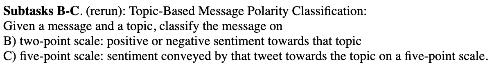

# 📝 Mise en contexte
Là, on en a marre. Théorie par-ci, explications fumeuses par là; quand est-ce qu'on pratique?

Et bien Marcel mets ta ceinture, parce qu'on va se lancer dans une grande aventure: celle de résoudre une tâche 
d'_Aspect Based Sentiment Analysis_.

Laquelle? Et bien comme on a été curieux, on sait désormais qu'il y a plusieurs challenges phares dans ce domaine: 
c'est les évènements _SemEval-20XX_ (pour _Semantic Evaluation_), déclinés en plusieurs millésimes de 2014 à 2017. 

Ceux qui se croient malin feront la remarque qu'il en existe d'autres jusque 2023 (et oui, on en fait une cuvée par an), 
mais je leur rappelerai que les tâches de ces challenges ne sont pas en lien avec l'ABSA.

Comme on aime la modernité, on va s'intéresser seulement au petit dernier, le **SemEval-2017**. 

# ⚙️ Mise en place de l'environnement

Alors direction le [site internet](https://alt.qcri.org/semeval2017/index.php?id=tasks) du challenge, regardons les 
problèmes à résoudre associés à:





On remarque que ce qui nous intéresse est sûrement dans les tâches 4 et 5, en jetant un oeil à la quatrième on réalise 
qu'il y a de quoi faire, puisque le problème **B** demande de trouver la polarité d'un message de tweet par topic.



Lançons nous sur cette tâche, téléchargeons les données et c'est parti!

# 🛢 Les données


On remarque cinq fichiers dans l'archive de données

 
En y jetant un oeil et en lisant le README on se rend compte que:
- **baseline-B-english.txt** est un fichier regroupant les prédictions de la méthode baseline pour le problème **B**, on y 
voit 3 colonnes: identifiant de tweet, topic et polarité  
- **SemEval2017-task4-dev.subtask-BD.english.INPUT.txt** est le dataset _train_, on y retrouve les mêmes colonnes ainsi 
qu'une de plus, contenant le texte des tweets
- **twitter-2016test-BD-English.txt** se fait appeler le "GOLD file", et qui est en fait un copier-coller du dataset de 
train, sans la dernière colonne. On a juste les vérités terrains quoi ⚠️En revanche, il s'agit des résultats de... 2016, 
donc on s'en fiche
- **SemEval2017_task4_test_scorer_subtaskB.pl** est un script `perl` permettant de calculer les métriques du challenge 
à partir de prédictions. Celles-ci sont: _macro-average Recall_, _macro-average F1_, et _Accuracy_


_Un exemple du dataset d'entraînement:_


# 📊 Evaluation

Première chose à faire, vérifions que le script d'évaluation fonctionne:

```shell
perl SemEval2017_task4_test_scorer_subtaskB.pl \
  SemEval2017-task4-dev.subtask-BD.english.INPUT.txt \  # PREDICTION
  SemEval2017-task4-dev.subtask-BD.english.INPUT.txt  # VERITE TERRAIN
```

On obtient les résultats suivants:


Et un fichier .scored est créé avec les métriques en question:
````text
	positive: P=1.0000, R=1.0000, F1=1.0000
	negative: P=1.0000, R=1.0000, F1=1.0000
		AvgF1_2=1.000, AvgR_3=1.000, Acc=1.000
	OVERALL SCORE : 1.000
````

Tout est loggé, les métriques sont au max, donc top on peut continuer.

Que donne la baseline en revanche? Effectuons le même test par la commande suivante:

````shell
perl SemEval2017_task4_test_scorer_subtaskB.pl \
  baseline-B-english.txt \                            
  SemEval2017-task4-dev.subtask-BD.english.INPUT.txt

````

On obtient ces résultats:
````text
	positive: P=1.0000, R=0.7783, F1=0.8753
	negative: P=0.0000, R=0.0000, F1=0.0000
		AvgF1_2=0.438, AvgR_3=0.389, Acc=0.778
	OVERALL SCORE : 0.438
````

Hum, notre baseline fonctionne bien pour prédire les polarités positives (il a un bon F1), mais il se gauffre 
complètement en prédisant des classes négatives.


# 🗓 Et ensuite

Quoi, c'est déjà fini?

Eh oui, on avance doucement mais sûrement, ce serait dommage de se cramer les ailes en si bon chemin non?

Au prochain épisode, on ira charger les données avec python 🐍, jouer un peu avec et ~~avec de la chance~~, on obtiendra 
des premiers résultats; j'ai hâte de vous les montrer!  

Allez, à la semaine prochaine!

---

